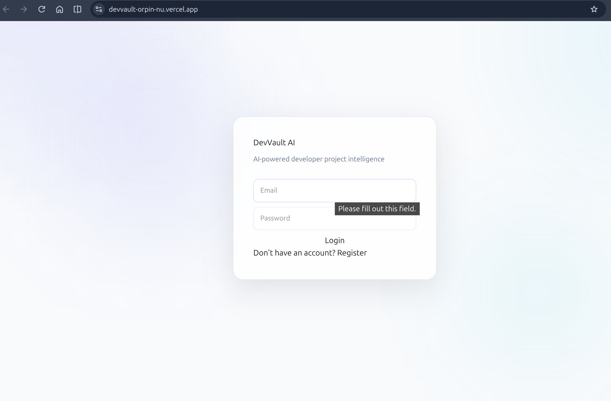
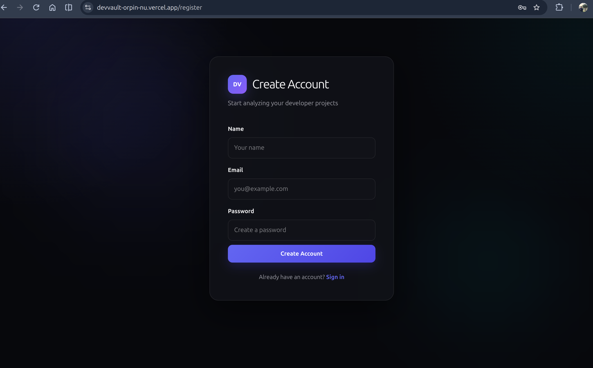
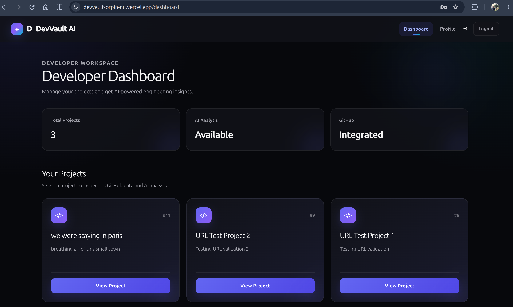
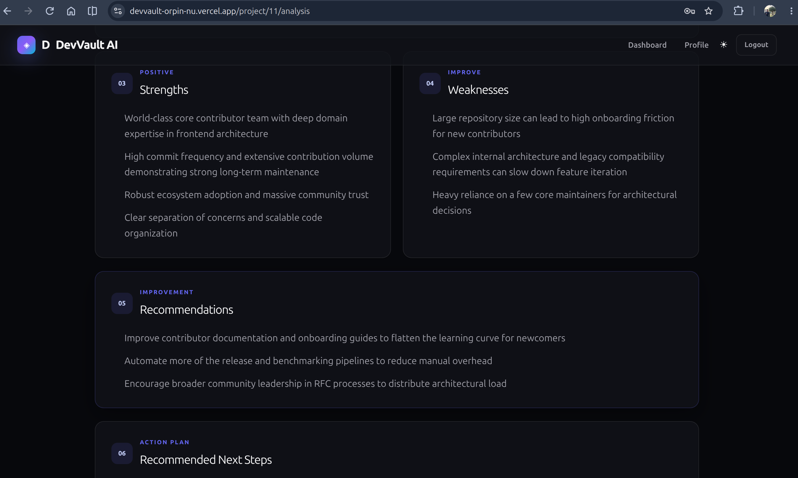
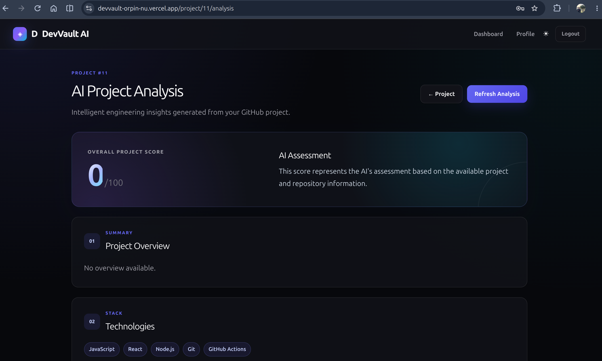
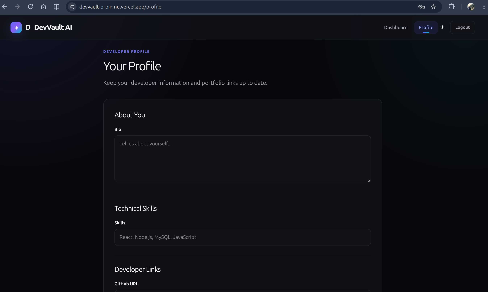

# DevVault AI 🚀

AI-powered developer project intelligence platform that connects GitHub repositories with Gemini AI to help developers understand, evaluate, and improve their software projects.

## 🌐 Live Demo

**Frontend:**  
https://devvault-orpin-nu.vercel.app/

**Backend API:**  
https://devvault-api-3dle.onrender.com/

**GitHub Repository:**  
https://github.com/user-abhay08/DevVault

---

# 📌 Overview

DevVault AI is a full-stack web application designed to provide developers with intelligent insights into their software projects.

Developers can:

- Create an account
- Authenticate securely using JWT
- Create and manage projects
- Connect projects to GitHub repositories
- Retrieve repository information
- Analyze project structure and development activity
- Generate AI-powered project insights
- Save AI analysis results
- Manage their developer profile

The application combines a React frontend, Node.js/Express REST API, MySQL database, GitHub API integration, and Gemini AI.

---

# ✨ Features

## 🔐 Authentication

- User registration
- User login
- Password hashing using bcrypt
- JWT-based authentication
- Protected API routes
- Role-based access control
- Automatic JWT handling from the frontend
- Authentication failure handling

## 📁 Project Management

Developers can:

- Create projects
- View projects
- View individual projects
- Update projects
- Delete projects
- Associate projects with GitHub repositories
- Store project descriptions and links

Project ownership is enforced using the authenticated user's ID.

## 🐙 GitHub Integration

DevVault AI integrates with the GitHub REST API to retrieve repository information including:

- Repository metadata
- Stars
- Forks
- Primary programming language
- Repository languages
- Commits
- Contributors
- README content
- Repository activity

GitHub repository URLs are parsed and validated before data is retrieved.

## 🤖 AI Project Analysis

GitHub project information is processed using Google's Gemini API.

The AI generates structured insights including:

- Project score
- Project overview
- Technologies
- Strengths
- Weaknesses
- Recommendations
- Next steps

AI responses are returned as structured JSON and persisted in MySQL.

## 💾 Persistent AI Analysis

Generated AI analysis is stored in the database.

Users can:

- Generate analysis
- View saved analysis
- Refresh analysis
- Check analysis availability
- View analysis timestamps

## 👤 Developer Profile

Users can manage:

- Bio
- Skills
- GitHub profile
- LinkedIn profile
- Portfolio URL

## 🎨 Modern React Dashboard

The frontend includes:

- Dashboard
- Project cards
- Project details
- GitHub repository information
- AI analysis interface
- Developer profile
- Authentication pages
- Protected routes
- Loading states
- Error states
- Responsive UI

---

# 📸 Screenshots

## 🔐 Login

Secure authentication interface for accessing the DevVault AI platform.



---

## 📝 Registration

Create a new developer account with secure password handling.



---

## 📊 Developer Dashboard

Centralized view of the developer's projects and project status.



---

## 📁 Project Details

View project information together with GitHub repository statistics, languages, contributors, stars, and forks.



---

## 🤖 AI Project Analysis

Gemini-powered analysis displaying project score, overview, technologies, strengths, weaknesses, recommendations, and next steps.



---

## 👤 Developer Profile

Manage developer information, skills, GitHub, LinkedIn, and portfolio links.



---

# 🛠️ Tech Stack

## Frontend

- React
- React Router
- Axios
- Vite
- Tailwind CSS
- CSS animations and responsive styling

## Backend

- Node.js
- Express.js
- REST API
- Axios
- JWT
- bcrypt
- CORS

## Database

- MySQL
- mysql2

## Integrations

- GitHub REST API
- Google Gemini API

## Deployment

- Vercel — Frontend
- Render — Backend
- Aiven — MySQL Database

## Development Tools

- Git
- GitHub
- VS Code
- Linux
- Postman

---

# 🏗️ System Architecture

```text
                         ┌─────────────────────┐
                         │      Developer      │
                         └──────────┬──────────┘
                                    │
                                    ▼
                         ┌─────────────────────┐
                         │   React Frontend    │
                         │       Vercel        │
                         └──────────┬──────────┘
                                    │
                              REST API + JWT
                                    │
                                    ▼
                         ┌─────────────────────┐
                         │   Express Backend   │
                         │       Render        │
                         └───────┬───────┬─────┘
                                 │       │
                     ┌───────────┘       └────────────┐
                     ▼                                ▼
          ┌────────────────────┐             ┌──────────────────┐
          │    Aiven MySQL     │             │    GitHub API    │
          │     Database       │             │                  │
          └────────────────────┘             └────────┬─────────┘
                                                      │
                                                      ▼
                                           ┌────────────────────┐
                                           │     Gemini AI      │
                                           │  Project Analysis  │
                                           └────────────────────┘